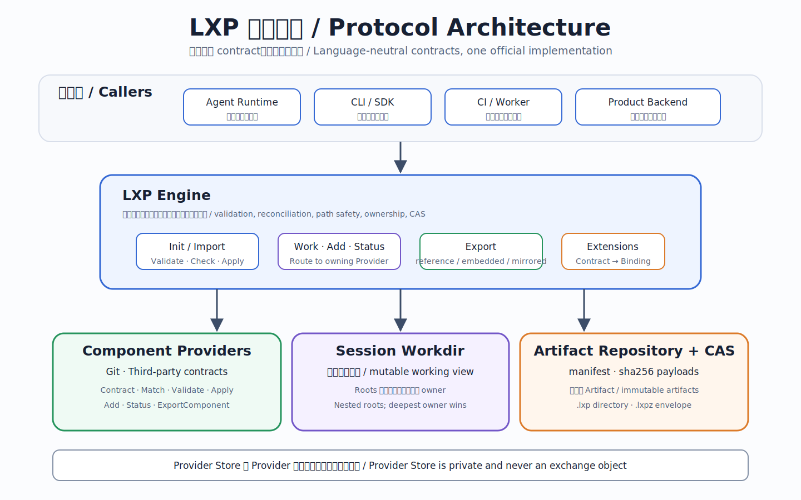
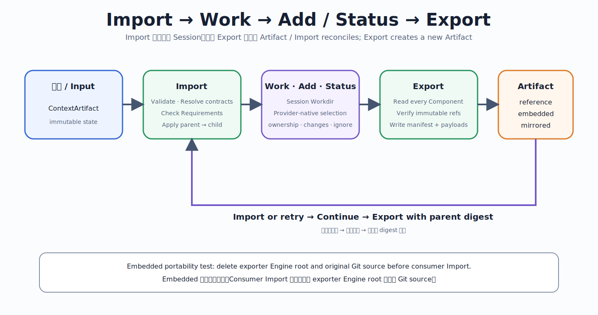

# LXP — Loop Exchange Protocol

**English** | [中文主版本](README.md)

LXP is an open exchange protocol for agent working context. It adopts Git's mental model: import an immutable state, work and select changes in a worktree, then export a new snapshot linked to its parent.

```text
Init/Import → Work → Add → Status → Export
                         │             │
                         └── Provider ─┘
```

LXP is not a deployment template, package installer, or workflow language. YAML is the machine exchange format; the CLI is the normal interface. Production MVP Artifacts are self-contained, content-addressed, and immutable.





## What Git-like means

- `lxp import` restores an Artifact into a working Session.
- `lxp add PATH...` resembles `git add`: delegate selection to the Provider that owns the path.
- `lxp status` aggregates root ownership and Provider-native status.
- `lxp export` resembles `git commit` plus portable packaging: read selected Provider state and create a new immutable Artifact.
- `provenance.parent` links the previous Artifact digest into a linear history. Branch, merge, and rebase are outside `v1alpha1`.

The analogy stops at usage. The protocol permits different Provider types; the first Production MVP guarantees Git-repository Components only.

## Core rules

1. **LXP tracks ownership; Providers track content.** A registered Component root is opaque to Core.
2. Component roots are non-overlapping. Core does not recursively interpret `.git`, `.oss`, or other markers inside an owned root.
3. `lxp add` inside a Component invokes its Provider's `Add`; only an unowned root triggers Provider discovery and Component registration.
4. A Provider is identified by stable `provider + contract`; Provider-specific `config` is opaque to Core.
5. Recursive or composite semantics belong in one composite Provider; Core still sees one Component.
6. Artifacts never carry executable Provider code. Import requires a preinstalled, trusted matching Provider contract and otherwise fails.
7. Providers may materialize with symlinks, Git worktrees, copies, reflinks, or mounts. The protocol standardizes the result, not the mechanism.
8. The Production MVP composes `git@v1` only, but fully supports reference, embedded, and mirrored `.lxpz` Artifacts; no matching Provider means failure.

The public CLI selects a form with `lxp export --distribution reference|embedded|mirrored` (default: embedded), and Import follows the Artifact declaration automatically. See the [Distribution guide](docs/distributions.en.md).

## Quick start

The fastest route is the complete black-box quickstart:

Install the `lxp` CLI from [`go-sdk`](https://github.com/loop-exchange-protocol/go-sdk), then pass it to the black-box Quickstart:

```bash
LXP_BIN="$(command -v lxp)" examples/quickstart/run.sh
```

It runs two real `init/import/add/status/export` generations, deletes the original worktree to prove standalone portability, and prints CLI-generated Artifact YAML. The shortest manual path is:

```bash
lxp init demo
cd demo
git clone YOUR_REPOSITORY source
# Change content, then select only the Git changes to exchange:
lxp add source/PATH
lxp export ../review-loop.lxpz
cd ..
lxp import review-loop.lxpz continued
```

Within a Git Component, `lxp add` invokes the native Git index without creating a nested Component. An unowned path with no matching Provider fails. `lxp import` validates the Artifact, displays Provider actions, and checks Requirements before any side effect.

## Documentation

- [v1alpha1 specification](docs/spec-v1alpha1.en.md) · [中文](docs/spec-v1alpha1.md)
- [Production MVP Profile](docs/production-mvp.en.md) · [中文](docs/production-mvp.md)
- [Go SDK and CLI](docs/go-engine.en.md) · [中文](docs/go-engine.md)
- [Requirements](docs/requirements.en.md) · [中文](docs/requirements.md)
- [Distribution guide](docs/distributions.en.md) · [中文](docs/distributions.md)
- [v1alpha1 conformance matrix](docs/conformance.en.md) · [中文](docs/conformance.md)
- [Ecosystem repository organization](docs/ecosystem.en.md) · [中文](docs/ecosystem.md)
- [Git-like CLI example](examples/git-like/README.en.md) · [中文](examples/git-like/README.md)
- [Complete executable quickstart](examples/quickstart/README.en.md) · [中文](examples/quickstart/README.md)
- [Artifact YAML example](examples/artifact/README.en.md) · [中文](examples/artifact/README.md)
- [Reference/Mirrored YAML examples](examples/distributions/README.en.md) · [中文](examples/distributions/README.md)
- [ContextArtifact Schema](schemas/v1alpha1/context-artifact.schema.json)
- [Artifact Lock Schema](schemas/v1alpha1/artifact-lock.schema.json)
- [Standalone HTML overview](dist/import-export-protocol.html)

## Alpha and trust boundary

`loop.exchange/v1alpha1` is a public alpha with **no forward or backward compatibility promise**. It is limited to trusted Artifacts. Schema, path, and digest validation plus explicit execution policy are defense in depth, not a complete security boundary for hostile input.

```bash
make ci
```
